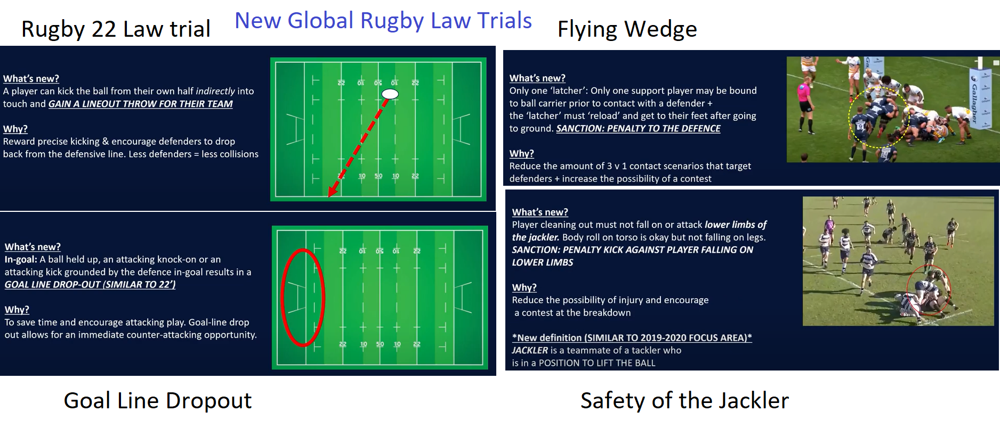

# rugby-ref-signals-ordered-penalties-free-kick-scrum
Trying to get a sense of the most often called rugby infringements with there ref signals

See my website at https://www.rocksetta.com/rugbyref/

## New Playlist

My Rugby Ref read the laws playlist https://www.youtube.com/playlist?list=PL57Dnr1H_egv70cA6v4cd0OwxeXdo3OcH

test page

The playing surface must be safe.
The permitted surface types are grass, sand, clay, snow or artificial turf (conforming to World Rugby Regulation 22).
The dimensions of the playing area are shown in the ground diagram.

The ground
Dimensions	Field of play length	In-goal length	Width
Maximum (metres)	100	22	70
Minimum (metres)	94	6	68
The playing area is rectangular in shape.
Any variations to these dimensions must be approved by the relevant union for domestic competitions or World Rugby for international matches.
Where the length of the field of play is less than 100 metres, the distance between the 10-metre lines and 22-metre lines is reduced accordingly.
Where the width of the playing area is less than 70 metres, the distance between the 15-metre lines is reduced accordingly.
The perimeter area should not be less than five metres wide where practicable.

LINES

There are solid lines configured as shown in the ground diagram. The solid lines are on:
The dead-ball lines and touch-in-goal lines.
The goal lines.
The 22-metre lines.
The half-way line.
The touchlines.
There are dash lines configured as shown in the ground diagram. Each dash within a dash line is five metres in length. There are dash lines:
Five metres from, and parallel to each touchline.
15 metres from, and parallel to, each touchline.
10 metres from, and parallel to, each side of the half-way line.
Five metres from, and parallel to, each goal line.
There is one line 0.5 metres long that intersects the centre of the half-way line.
GOAL POSTS AND CROSSBAR

When padding is attached to the goal posts the distance from the goal line to the external edge of the padding must not exceed 0.3 metres.

Goal posts
FLAG POSTS

There are 14 flag posts with flags, each with a minimum height of 1.2 metres.
One flag post is positioned at each intersection of the touch-in-goal lines and the goal lines and one at each intersection of the touch-in-goal lines and the dead-ball lines (eight flag posts in total).
One flag post is positioned in line with the 22-metre line and the half-way line on each side of the pitch, two metres outside the touchlines and within the playing enclosure (six flag posts in total).
OBJECTIONS TO THE GROUND

Teams must inform the referee of any objections before the match starts.
The referee will attempt to resolve the issues and will not start a match if any part of the ground is considered to be unsafe.

Great links:

https://docs.google.com/spreadsheets/d/15JNs-PIrUKW0SS9bAy0UxCjKtQCovFydh3zoDKVb8TA/edit#gid=1799259824

https://www.sd43.bc.ca/school/summit/SportsMusicClubs/Documents/RUGBY%20FOR%20DUMMIES%20CHEAT%20SHEET.pdf

https://sports.bluesombrero.com/Default.aspx?tabid=363155

https://www.myactivesg.com/Sports/Rugby/How-To-Play/Rugby-for-Beginners/Rugby-Union-The-Basics

.

After 30 years of rugby coaching I have started reffing and am having a hard time learning the ref secondary signals. Here is an attempt to order them by most often called. (Please send a pull request or message me on twitter [@rocksetta](https://twitter.com/rocksetta) if you wish to make an addition or suggest a change in the order )

resources at:

Nigel Owens  http://www.bruffrfc.com/understanding-referees-signals-strictly-for-rugby-geeks/2015/09/16/

BBC Sport http://news.bbc.co.uk/sportacademy/bsp/hi/rugby_union/rules/referees_signals/html/default.stm

Rugby Nor Cal  https://www.rugbynorcal.org/spectators-guide-to-rugby/

# Images and videos from world rugby at https://laws.worldrugby.org/?signal_category=2

Note: That this list is just for youth rugby, the order might be fairly different for World Cup rugby.

## Ref Signals in order of Most Often Called (Very un-scientific just how I feel about it.) 

1. Penalty (Primary Ref Signal) 
1. Scrum (Primary Ref Signal)  

1. Knock-on (scrum) 

1. Throw forward or forward pass (scrum) 
1. Try  
1. Tackler or tackled player not rolling away (penalty) 

1. Not releasing ball immediately in the tackle (penalty) 
1. Tackler not releasing tackled player (penalty) 

1. Handling ball in ruck or scrum (penalty) 

1. Offside at scrum, ruck or maul (penalty) 
1. Throw at lineout not straight (scrum) 
1. Forming a scrum 

1. High tackle (foul play) (penalty) 
1. Time off 
1. Timekeeper to stop and start watch 
1. Offside under 10-metre law or not 10 metres at penalty and free-kicks (penalty) 

1. Obstruction in open play (penalty) 

1. Failure to bind (penalty) 

1. Offside in the lineout (penalty) 
1. Offside choice: penalty or scrum 
1. Diving to the ground near the tackle (penalty) 
1. Intentionally collapsing ruck or maul (penalty) 
1. 22 drop-out 

1. Prop pulling down opponent (penalty) 
1. Referee consults TMO 
1. Entering tackle from wrong direction (penalty) 
1. Ball held up in in-goal (scrum) 
1. Unplayable ball in ruck or tackle (scrum) 
1. Unplayable ball in maul (scrum) 

1. Scrum wheeled more than 90 degrees (scrum) 

1. Free Kick (Primary Ref Signal) 
1. Foot-up by front-row player (free-kick) 
1. Throw at scrum not straight (free-kick) 
1. Closing gaps in lineout (free-kick) 
1. Early lifting and lifting in lineout (free-kick) 

1. Head injury assessment required 
1. Dissent (disputing referee’s decision) (penalty) 
1. Intentionally falling over on a player (penalty) 
1. Joining a ruck or a maul in front of the back foot and from the side (penalty) 

1. Doctor needed 
1. Bleeding wound 
1. Prop pulling opponent (penalty) 
1. Barging in lineout (penalty) 

1. Leaning on player in lineout (penalty) 
1. Pushing opponent in lineout (penalty) 
1. Stamping (foul play) (penalty) 
1. Punching (foul play) (penalty) 
1. Physiotherapist needed 

## Global Rugby Law Trials

[yuotube simplified](https://www.youtube.com/watch?v=yAMIce2CqNU)

